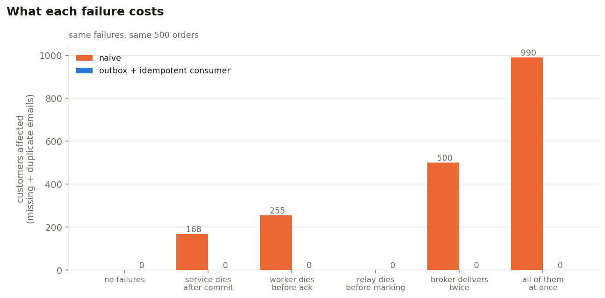
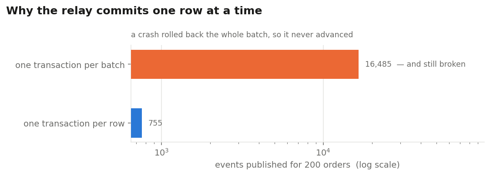

# outbox-lab


An order service, a queue and a worker — written the way most people write it first, then written again with two patterns applied. A failure injector kills each part at the exact moment it would hurt, and the result is counted in customers affected.

Every number below came from running the code in this repo. `make all` regenerates all of it.

---

<!-- RESULTS:START -->

## Six failures, 500 orders, two versions of the same system

Every number is a customer outcome. **Missing** means an order was placed and no confirmation ever went out. **Duplicate** means the same confirmation went out more than once — if it were a charge instead of an email, that is real money.

| What breaks | Naive: missing | Naive: duplicate | Guarded: missing | Guarded: duplicate |
|---|---|---|---|---|
| No failures | 0 | 0 | 0 | 0 |
| Service dies between saving the order and publishing | **168** | 0 | 0 | 0 |
| Worker dies after the work, before acknowledging | 0 | **255** | 0 | 0 |
| Relay dies after publishing, before marking it sent | 0 | 0 | 0 | 0 |
| Broker delivers every message twice | 0 | **500** | 0 | 0 |
| All of the above, together | 0 | **990** | 0 | 0 |



**The naive version broke in 4 of 6 scenarios. The guarded version broke in 0.**

**The row to look at is the relay one.** The guarded version published **755 events for 500 orders** in that scenario — 255 of them duplicates that the outbox itself created. Zero duplicate emails came out the other end, because the consumer deduplicates. Neither pattern would have been enough alone.

## The relay bug, measured

Both relays do the same job under the same 30% crash rate. The only difference is how often they commit.

| Relay | Events published | Emails delivered | Orders with no email | Stuck in the outbox |
|---|---|---|---|---|
| one transaction per batch | 16,485 | 25 | **475** | **500** |
| one transaction per row | 755 | 500 | 0 | 0 |



The batched relay did **22× the work** and still left 475 orders without a confirmation. That publish count is not a final figure — it is where the harness stopped restarting it after 5,000 crashes, and it had not converged. Committing one row at a time is not an optimisation; it is the difference between working and not.

<!-- RESULTS:END -->

---

## The bug this is about

Two writes, two systems, no way to make both happen:

```python
db.commit()                        # the order is saved
queue.publish("order.created")     # ← crash here and the event never existed
```

The order is in the database. The confirmation email will never be sent. Nothing logs an error, nothing retries, and nobody finds out until the customer asks where their receipt is.

This is called the **dual-write problem**, and it has a well-known fix that almost nobody implements, because it looks like it isn't needed right up until it is.

## The fix, and why it is two patterns

**1 · The transactional outbox.** Write the event into a table in the *same transaction* as the business row. There is no instant where one exists without the other. A separate relay process reads that table, publishes, and marks the row sent.

**2 · The idempotent consumer.** The worker claims the event id in a table with a `PRIMARY KEY`, and does the work in the same transaction. A second delivery of the same event fails the insert and is skipped.

**They are not alternatives, and this is the part worth understanding.** The outbox makes duplicates *more* likely, not less: a relay that publishes and then dies before marking the row sent will publish it again. You have traded "sometimes lost" for "sometimes twice". That is only an improvement if the consumer is safe to run twice.

**The measurement is in the table above.** In the relay-crash scenario the guarded version publishes substantially more events than there are orders, and delivers exactly one email per order anyway.

---

## What I got wrong

**1. My first relay never made any progress.**
It claimed a batch of 50 outbox rows, published them all, and marked them all sent in one transaction. With a 30% chance of dying after each publish, a batch of 50 essentially never completes — so every crash rolled back every mark in that batch, the relay re-published the same first few events forever, and the outbox never drained. It published tens of thousands of events for 200 orders and still left every order without a confirmation. Committing one row at a time fixed it. Both versions are in `pipeline.py` and the comparison is measured, because the broken one looks completely reasonable until something fails.

**2. I nearly put the dedupe insert in its own transaction.**
Claim the event id, commit, then do the work. It reads more cleanly and it is much worse than the bug it replaces: a crash between the two marks the event as handled without having handled it, so the work is lost silently and no retry will ever pick it up. The claim and the work have to commit together. There is a test that fails if they are ever separated.

**3. The chaos harness is honest about what it is not.**
Crashes are raised at the exact instruction where a process would die, not sent as `SIGKILL`. That makes runs deterministic and repeatable for a given seed, which is what I wanted. It does not test a half-written disk page or an OS-level kill. For that, `docker compose up` runs the five pieces as real processes and you can `docker compose kill worker` by hand.

---

## Run it

Nothing to install but Postgres and Python. The chaos harness uses an in-process broker, so there is no service chase.

```bash
make db        # create the database, once
make all       # six scenarios, both versions, charts, README
make test      # 13 tests
```

### The real thing, as five processes

```bash
make up        # Postgres, RabbitMQ, the API, the relay, the worker

curl -X POST localhost:8000/orders \
  -H 'content-type: application/json' \
  -d '{"customer_id": 1, "amount_cents": 1999}'

docker compose kill worker      # mid-message, no acknowledgement
docker compose start worker
curl localhost:8000/invariants  # nothing lost, nothing doubled
```

Set `MODE=naive` and do the same thing to watch it break.

---

## What's in here

```
sql/schema.sql          four tables; two exist only because there's a queue
src/pipeline.py         both versions side by side -- the whole comparison
src/broker.py           at-least-once, in memory and over RabbitMQ
src/chaos.py            the six scenarios and the runner
src/relay_experiment.py the relay bug, measured
src/invariants.py       what a customer would call correct
src/report.py           rewrites the README tables from results/
api/main.py             FastAPI, with liveness and readiness that differ

tests/test_lab.py       13 tests, including that the failures ARE reproduced
docker-compose.yml      the five processes, for real kills
```

## Method

- **Seeded and reproducible.** Same seed, same crashes, same numbers. A failure test you cannot repeat is an anecdote.
- **Both versions face identical failures.** Same injection points, same rates, same seed.
- **The invariants are business properties, not code properties.** "Every order got exactly one confirmation" is the same question whichever version ran.
- **The tests assert that the naive version breaks.** If fault injection stops working, those tests fail and every other number here would be meaningless.
- **The README tables are generated**, not typed. `make report` rewrites them from `results/*.csv` so the prose and the data cannot drift apart.

## What I'd do next

- **Publisher confirms.** The outbox protects the handoff from the database to the broker. It does not protect against the broker accepting a message and then losing it. The relay should wait for a confirm before marking the row sent, and I'd want to measure that gap rather than assume it.
- **Prune the dedupe table.** `processed_events` grows forever as written. A real deployment needs a retention window, and that window has to be longer than the longest possible redelivery.
- **Real process kills in the harness.** Running the relay and worker as subprocesses and sending real `SIGKILL`s, so the finding doesn't depend on my injection points being in the right places.
- **Ordering.** Nothing here tests what happens when events arrive out of order, which is the next thing that breaks in a system like this.

## Built with
Python 3.12 · PostgreSQL 16 · RabbitMQ · FastAPI · psycopg 3 · pytest · Docker Compose · GitHub Actions
